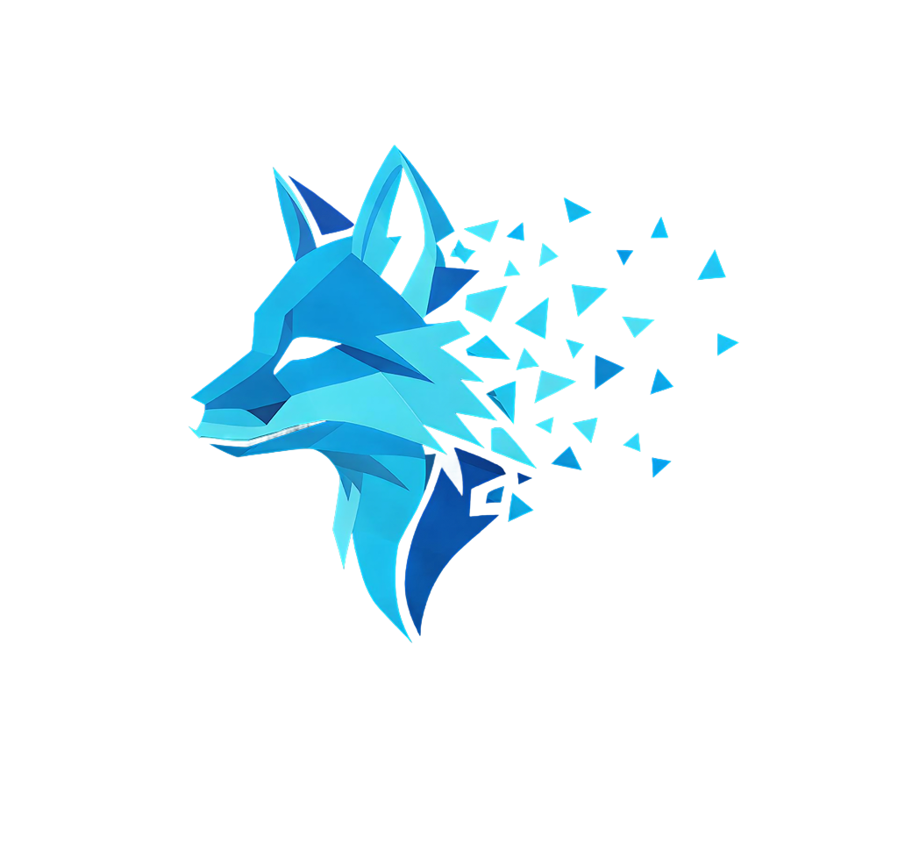

# Vanished

### Comunicação privada com cifragem ponta-a-ponta

Aplicação desktop de mensagens privadas com cliente **.NET/Avalonia**, API **FastAPI**, base de dados **PostgreSQL**, cache **Redis** e infraestrutura publicada com **Docker**, **Caddy**, **Cloudflare** e **TLS**.

 

 

[Website](https://vanished.pt) · [Licença](#licença)

---

## Índice

- [Sobre](#sobre)
- [Destaques](#destaques)
- [Demonstração](#demonstração)
- [Stack tecnológica](#stack-tecnológica)
- [Arquitetura](#arquitetura)
- [Segurança](#segurança)
- [Instalação](#instalação)
- [Configuração](#configuração)
- [Execução](#execução)
- [Testes e validação](#testes-e-validação)
- [Relatório técnico](#relatório-técnico)
- [Roadmap](#roadmap)
- [Licença](#licença)
- [Autor](#autor)

---

## Sobre

**Vanished** é uma aplicação de comunicação privada desenvolvida no âmbito da **Prova de Aptidão Profissional** do curso de **Programador/a de Informática**.

O projeto demonstra uma arquitetura cliente-servidor onde o conteúdo das mensagens é protegido no cliente antes de ser enviado para a API. O servidor gere autenticação, sessões, dispositivos, conversas e entrega de mensagens, mas trabalha apenas com envelopes cifrados.

A aplicação foi construída com foco em:

- privacidade;
- segurança aplicacional;
- cifragem ponta-a-ponta;
- separação de responsabilidades;
- infraestrutura real.

---

## Destaques

| Área | Implementação |
|---|---|
| Cliente desktop | C# · .NET 8 · Avalonia UI |
| Backend | Python · FastAPI · Uvicorn |
| Base de dados | PostgreSQL |
| Cache e estado temporário | Redis |
| Tempo real | WebSocket |
| Reverse proxy | Caddy |
| DNS e camada pública | Cloudflare |
| Transporte seguro | HTTPS/TLS |
| Cifragem ponta-a-ponta | X25519 · HKDF-SHA256 · AES-256-GCM |
| Assinatura de pedidos | Ed25519 |
| Derivação de chaves | Argon2id |
| Licença do código | Apache License 2.0 |
| Marca e materiais visuais | Todos os direitos reservados |

---

## Demonstração

| Recurso | Endereço |
|---|---|
| Website público | https://vanished.pt |

O website apresenta o projeto, as funcionalidades principais, a abordagem de segurança, a secção de perguntas frequentes e os downloads da aplicação.

---

## Stack tecnológica

### Cliente desktop

- C#;
- .NET 8;
- Avalonia UI 11;
- AXAML/XAML;
- Newtonsoft.Json;
- Nsec.Cryptography;
- Portable.BouncyCastle;
- Konscious Argon2;
- System.IdentityModel.Tokens.Jwt.

### Servidor API

- Python;
- FastAPI;
- Uvicorn;
- SQLAlchemy;
- PyJWT;
- pyotp;
- cryptography;
- argon2-cffi;
- WebSocket.

### Infraestrutura

- PostgreSQL;
- Redis;
- Docker Compose;
- Caddy;
- Cloudflare;
- UFW Firewall;
- TLS/HTTPS;
- Brevo.

---

## Arquitetura

O Vanished está dividido em três camadas principais.

### Cliente desktop

O cliente executa a interface, autenticação local, gestão de sessão, comunicação com a API, geração de material criptográfico, cifragem das mensagens e assinatura dos pedidos críticos.

### Servidor API

A API valida utilizadores, dispositivos, permissões, sessões e pedidos assinados. Também gere conversas, mensagens cifradas, eventos WebSocket e persistência.

### Infraestrutura pública

A infraestrutura utiliza Docker Compose para organizar os serviços, Caddy como reverse proxy, Cloudflare para DNS/proxy e TLS/HTTPS para transporte seguro.

---

## Segurança

O projeto aplica segurança desde a arquitetura. As mensagens são cifradas no cliente antes de serem enviadas para a API. O servidor não recebe o conteúdo das mensagens privadas em texto claro.

### Mecanismos principais

| Mecanismo | Função |
|---|---|
| X25519 | Acordo de chaves entre remetente e destinatário |
| HKDF-SHA256 | Derivação de chave simétrica a partir do segredo partilhado |
| AES-256-GCM | Cifragem autenticada das mensagens |
| Ed25519 | Assinatura digital de pedidos por dispositivo |
| Argon2id | Derivação de chaves locais |
| JWT HS256 | Sessões autenticadas |
| Refresh tokens com hash | Redução de exposição em caso de fuga da base de dados |
| Redis | Rate limiting e proteção anti-replay |
| TLS/HTTPS | Transporte seguro entre cliente e servidor |
| UFW Firewall | Controlo de exposição do servidor |

### Princípios aplicados

- Chaves privadas mantidas no cliente;
- Servidor limitado a envelopes cifrados e metadados necessários;
- Separação entre cliente, API, base de dados, cache e reverse proxy;
- Pedidos críticos assinados por dispositivo;
- Limitação de abuso com rate limiting;
- Proteção contra reutilização de pedidos;
- Registos de segurança sem exposição de segredos.

---

## Testes e validação

O projeto foi validado através de testes manuais, inspeção da base de dados, análise dos fluxos críticos, verificação da infraestrutura e revisão dos mecanismos de segurança.

### Fluxos testados

- Criação de conta;
- Validação de e-mail;
- Login;
- Gestão de sessões;
- Registo de dispositivos;
- Pesquisa de utilizadores;
- Pedidos de conversa;
- Envio e receção de mensagens;
- Comunicação WebSocket;
- Persistência de envelopes cifrados;
- Configuração HTTPS;
- Reverse proxy;
- Firewall;
- Docker Compose;
- Website de apresentação.

---

## Relatório técnico

O relatório da Prova de Aptidão Profissional documenta o projeto em detalhe.

Inclui:

- introdução e motivação;
- estado da arte;
- contextualização do projeto;
- arquitetura da aplicação;
- fluxos de criação de conta, login e mensagens;
- modelo entidade-relação;
- requisitos funcionais e não funcionais;
- tecnologias utilizadas;
- criptografia e segurança aplicacional;
- metodologia;
- implementação;
- configuração de servidor, domínio, Cloudflare e firewall;
- conclusão;
- referências bibliográficas;
- anexos técnicos.

---

## Roadmap

- Implementação de Double Ratchet completo;
- Auditoria externa ao código criptográfico;
- Suporte para anexos cifrados;
- Aplicação mobile;
- Chamadas cifradas de voz e vídeo;
- Testes automatizados completos;
- Assinatura digital dos instaladores;
- Sistema público de checksums para releases;
- Painel de monitorização operacional.

---

## Licença

O código-fonte está licenciado sob a **Apache License 2.0**.

O nome **Vanished**, o logotipo, o relatório PAP, capturas de ecrã, diagramas, imagens e restantes materiais visuais são propriedade do autor e mantêm **todos os direitos reservados**.

Ver:

- [`LICENSE`](LICENSE/LICENSE)
- [`NOTICE`](LICENSE/NOTICE)

---

## Autor

**António João Carvalho Silva**

Curso de **Programador/a de Informática**  
**Escola Secundária Frei Heitor Pinto**  
Prova de Aptidão Profissional · **2023–2026**

---

**Vanished** — comunicação privada com E2EE.

